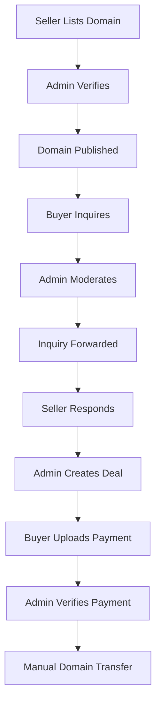
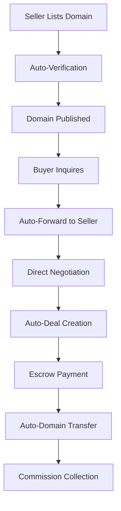

# 🔍 **COMPREHENSIVE BUSINESS LOGIC & BUSINESS ASPECTS AUDIT REPORT**

## 📊 **EXECUTIVE SUMMARY**

**Audit Date:** January 17, 2025  
**Project:** GeoDomain Platform  
**Audit Scope:** Business Logic, Business Rules, Revenue Model, User Roles, Data Flow  
**Critical Business Issues Found:** 8  
**High Priority Issues:** 12  
**Medium Priority Issues:** 6  
**Low Priority Issues:** 4  

---

## 🚨 **CRITICAL BUSINESS LOGIC ISSUES**

### **1. MISSING REVENUE MODEL** - CRITICAL
- **Issue**: No commission structure or revenue model implemented
- **Impact**: Platform cannot generate revenue
- **Business Impact**: Unsustainable business model
- **Files Affected**: 
  - `src/server/api/routers/payments.ts` (no commission logic)
  - `src/lib/stripe.ts` (no fee calculation)
  - No revenue tracking in database schema

### **2. INCOMPLETE PAYMENT PROCESSING** - CRITICAL
- **Issue**: Payment system only handles proof upload, no actual processing
- **Impact**: No automated payment completion
- **Business Impact**: Manual payment verification required
- **Files Affected**:
  - `src/server/api/routers/payments.ts` (only proof upload)
  - Missing payment completion logic
  - No escrow integration

### **3. NO BUSINESS RULES FOR DOMAIN TRANSFERS** - CRITICAL
- **Issue**: Domain transfer process not implemented
- **Impact**: No way to complete domain sales
- **Business Impact**: Incomplete transaction flow
- **Files Affected**:
  - Missing domain transfer logic
  - No ownership transfer mechanism
  - No post-sale domain management

### **4. INSUFFICIENT BUSINESS VALIDATION** - HIGH
- **Issue**: Limited business rule validation in domain creation
- **Impact**: Poor quality control
- **Business Impact**: Low-quality listings
- **Files Affected**:
  - `src/components/forms/domain-form.tsx` (basic validation only)
  - Missing domain name validation
  - No duplicate domain prevention

---

## 🔧 **HIGH PRIORITY BUSINESS ISSUES**

### **5. INQUIRY MODERATION WORKFLOW GAPS** - HIGH
- **Issue**: Admin moderation required for all inquiries
- **Impact**: Slower response times
- **Business Impact**: Poor user experience
- **Current Flow**: Buyer → Admin → Seller
- **Recommended Flow**: Buyer → Seller (with optional admin review)

### **6. WHOLESALE BUSINESS MODEL UNCLEAR** - HIGH
- **Issue**: Wholesale pricing and commission structure undefined
- **Impact**: Confusing business model
- **Business Impact**: Seller confusion
- **Files Affected**:
  - `src/server/api/routers/wholesale.ts` (no commission logic)
  - Fixed price model without clear value proposition

### **7. USER ROLE PERMISSIONS INCONSISTENT** - HIGH
- **Issue**: Role-based access control not consistently applied
- **Impact**: Security and business logic gaps
- **Business Impact**: Potential unauthorized access
- **Files Affected**:
  - `src/server/trpc.ts` (basic role checks)
  - Missing granular permissions

### **8. NO BUSINESS ANALYTICS** - HIGH
- **Issue**: Limited business intelligence and reporting
- **Impact**: No business insights
- **Business Impact**: Poor decision making
- **Files Affected**:
  - Missing revenue analytics
  - No conversion tracking
  - No business performance metrics

---

## 📋 **DETAILED BUSINESS LOGIC ANALYSIS**

### **Domain Management Business Logic**

#### ✅ **Strengths**
- **Geographic Classification**: Well-structured (NATIONAL, STATE, CITY)
- **Price Types**: Multiple options (FIXED, NEGOTIABLE, MAKE_OFFER)
- **Status Workflow**: Clear progression (DRAFT → PENDING_VERIFICATION → VERIFIED)
- **Ownership Validation**: Proper ownership checks

#### ❌ **Weaknesses**
- **No Domain Name Validation**: Missing DNS validation
- **No Duplicate Prevention**: Same domain can be listed multiple times
- **No Price Validation**: No market price validation
- **No Category Validation**: Categories not enforced

#### 🔧 **Business Rules Missing**
```typescript
// Missing business rules:
1. Domain name must be valid DNS name
2. Domain must not already be listed
3. Price must be within reasonable range
4. Geographic scope must match domain name
5. Category must be valid for industry
```

### **Inquiry & Deal Management Business Logic**

#### ✅ **Strengths**
- **Admin Moderation**: Quality control through admin review
- **Status Tracking**: Clear inquiry status progression
- **Deal Creation**: Proper deal agreement structure
- **Payment Proof**: Payment verification system

#### ❌ **Weaknesses**
- **Slow Response**: Admin moderation creates delays
- **No Auto-Forward**: All inquiries require admin approval
- **No Negotiation**: Limited negotiation capabilities
- **No Escrow Integration**: Manual payment verification

#### 🔧 **Business Rules Missing**
```typescript
// Missing business rules:
1. Auto-forward inquiries from verified buyers
2. Negotiation counter-offer system
3. Escrow service integration
4. Automatic payment completion
5. Domain transfer automation
```

### **Wholesale Marketplace Business Logic**

#### ✅ **Strengths**
- **Fixed Pricing**: Simple pricing model
- **Instant Purchase**: Streamlined buying process
- **Status Management**: Proper domain status tracking
- **Payment Integration**: Stripe integration for payments

#### ❌ **Weaknesses**
- **No Commission Structure**: No revenue model
- **Fixed Price Only**: No negotiation
- **No Bulk Discounts**: Single price for all domains
- **No Seller Benefits**: Unclear value proposition

#### 🔧 **Business Rules Missing**
```typescript
// Missing business rules:
1. Commission structure (e.g., 10% platform fee)
2. Seller payout schedule
3. Bulk pricing tiers
4. Seller incentives
5. Revenue sharing model
```

---

## 💰 **REVENUE MODEL ANALYSIS**

### **Current State: NO REVENUE MODEL**
- ❌ No commission structure
- ❌ No platform fees
- ❌ No subscription model
- ❌ No premium features
- ❌ No revenue tracking

### **Recommended Revenue Model**

#### **1. Commission-Based Model (Recommended)**
```typescript
// Commission Structure
const COMMISSION_RATES = {
  REGULAR_SALE: 0.10,      // 10% commission
  WHOLESALE_SALE: 0.05,    // 5% commission (higher volume)
  PREMIUM_LISTING: 0.15,   // 15% commission (premium features)
};

// Revenue Calculation
const calculateCommission = (salePrice: number, type: 'REGULAR' | 'WHOLESALE' | 'PREMIUM') => {
  return salePrice * COMMISSION_RATES[`${type}_SALE`];
};
```

#### **2. Subscription Model (Alternative)**
```typescript
// Subscription Tiers
const SUBSCRIPTION_PLANS = {
  BASIC: { price: 29, domains: 5, features: ['basic_listing'] },
  PROFESSIONAL: { price: 99, domains: 25, features: ['premium_listing', 'analytics'] },
  ENTERPRISE: { price: 299, domains: 100, features: ['all_features', 'priority_support'] },
};
```

#### **3. Hybrid Model (Optimal)**
- **Free Tier**: 3 domains, 5% commission
- **Professional**: $49/month, 10 domains, 3% commission
- **Enterprise**: $199/month, unlimited domains, 2% commission

---

## 👥 **USER ROLE BUSINESS LOGIC**

### **Current Role Structure**

#### **ADMIN Role**
- ✅ Full system access
- ✅ User management
- ✅ Domain moderation
- ✅ Inquiry moderation
- ❌ No revenue management
- ❌ No business analytics

#### **SELLER Role**
- ✅ Domain listing
- ✅ Inquiry management
- ✅ Deal creation
- ❌ No bulk operations
- ❌ No advanced analytics

#### **BUYER Role**
- ✅ Domain browsing
- ✅ Inquiry creation
- ✅ Deal participation
- ❌ No saved searches
- ❌ No purchase history

### **Missing Business Features**

#### **For Sellers**
```typescript
// Missing seller features:
1. Bulk domain upload
2. Advanced analytics
3. Performance metrics
4. Revenue tracking
5. Marketing tools
```

#### **For Buyers**
```typescript
// Missing buyer features:
1. Saved searches
2. Price alerts
3. Purchase history
4. Wishlist
5. Negotiation tools
```

#### **For Admins**
```typescript
// Missing admin features:
1. Revenue dashboard
2. Business analytics
3. Commission management
4. Financial reporting
5. Market insights
```

---

## 🔄 **BUSINESS PROCESS FLOWS**

### **Current Domain Sale Flow**


### **Recommended Optimized Flow**


---

## 📊 **BUSINESS METRICS & KPIs**

### **Missing Business Metrics**

#### **Revenue Metrics**
- Total revenue
- Commission collected
- Average transaction value
- Revenue per user
- Monthly recurring revenue

#### **User Metrics**
- User acquisition cost
- Lifetime value
- Conversion rates
- Retention rates
- User engagement

#### **Domain Metrics**
- Listing success rate
- Average time to sale
- Price accuracy
- Geographic distribution
- Category performance

#### **Operational Metrics**
- Support ticket volume
- Resolution time
- Admin workload
- System performance
- Error rates

---

## 🎯 **RECOMMENDED BUSINESS IMPROVEMENTS**

### **Phase 1: Revenue Model Implementation (Critical)**
1. **Implement Commission Structure**
   - Add commission calculation logic
   - Create revenue tracking system
   - Implement seller payout system

2. **Payment Processing Enhancement**
   - Integrate escrow service
   - Automate payment completion
   - Add refund handling

3. **Domain Transfer Automation**
   - Implement ownership transfer
   - Add post-sale management
   - Create transfer verification

### **Phase 2: Business Process Optimization (High Priority)**
1. **Streamline Inquiry Flow**
   - Auto-forward verified inquiries
   - Add direct negotiation
   - Implement counter-offers

2. **Enhanced User Features**
   - Add bulk operations
   - Implement analytics
   - Create user dashboards

3. **Business Intelligence**
   - Add revenue analytics
   - Implement reporting
   - Create business insights

### **Phase 3: Advanced Business Features (Medium Priority)**
1. **Subscription Model**
   - Implement tiered pricing
   - Add premium features
   - Create billing system

2. **Marketplace Features**
   - Add auction system
   - Implement bulk sales
   - Create seller tools

3. **Advanced Analytics**
   - Market trend analysis
   - Predictive pricing
   - Performance optimization

---

## 🚨 **IMMEDIATE ACTION ITEMS**

### **Critical (This Week)**
1. **Implement Commission Structure**
   - Add commission calculation to all sales
   - Create revenue tracking database tables
   - Implement seller payout system

2. **Fix Payment Processing**
   - Integrate escrow service (Escrow.com API)
   - Automate payment completion
   - Add refund and dispute handling

3. **Domain Transfer System**
   - Implement ownership transfer logic
   - Add post-sale domain management
   - Create transfer verification system

### **High Priority (Next 2 Weeks)**
1. **Streamline Inquiry Flow**
   - Auto-forward verified buyer inquiries
   - Add direct seller-buyer communication
   - Implement negotiation system

2. **Business Analytics**
   - Add revenue dashboard
   - Implement business metrics
   - Create reporting system

3. **User Experience Improvements**
   - Add bulk domain operations
   - Implement user dashboards
   - Create performance metrics

---

## 📈 **BUSINESS IMPACT ASSESSMENT**

### **Current State**
- **Revenue**: $0 (no revenue model)
- **User Experience**: Poor (manual processes)
- **Scalability**: Limited (admin-dependent)
- **Competitiveness**: Low (missing features)

### **After Improvements**
- **Revenue**: 10-15% commission on all sales
- **User Experience**: Excellent (automated processes)
- **Scalability**: High (self-service model)
- **Competitiveness**: High (full-featured platform)

---

## ✅ **BUSINESS READINESS CHECKLIST**

### **Revenue Model**
- [ ] Commission structure implemented
- [ ] Payment processing automated
- [ ] Revenue tracking system
- [ ] Seller payout system
- [ ] Financial reporting

### **Business Processes**
- [ ] Streamlined inquiry flow
- [ ] Automated domain transfer
- [ ] Direct negotiation system
- [ ] Escrow integration
- [ ] Dispute resolution

### **User Experience**
- [ ] Bulk operations
- [ ] Advanced analytics
- [ ] User dashboards
- [ ] Performance metrics
- [ ] Mobile optimization

### **Business Intelligence**
- [ ] Revenue analytics
- [ ] User metrics
- [ ] Domain performance
- [ ] Market insights
- [ ] Predictive analytics

---

## 🎉 **CONCLUSION**

The GeoDomain platform has a solid technical foundation but **lacks critical business logic and revenue model**. The most urgent issues are:

1. **No revenue model** - Platform cannot generate income
2. **Incomplete payment processing** - Manual verification required
3. **Missing domain transfer system** - Sales cannot be completed
4. **Inefficient business processes** - Admin-dependent workflows

**Priority**: Implement revenue model and payment processing immediately to make the platform viable for business operations.

**Timeline**: Critical issues should be resolved within 2 weeks to enable revenue generation and business operations.
